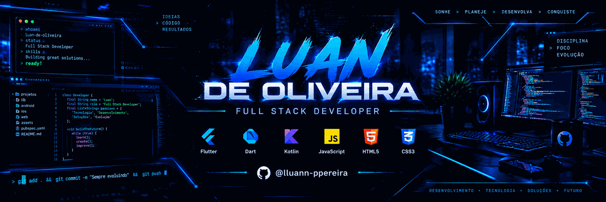

<div align="center">

<p align="center">
  
</p>
</div>

---

## 👨‍💻 Sobre mim

Sou **Desenvolvedor Full Stack** com experiência como freelancer em projetos de desenvolvimento de software.

Tenho experiência no desenvolvimento de sites, aplicações web, APIs, aplicações mobile e sistemas integrados a bancos de dados.

Tenho interesse principalmente em:

* 🌐 Desenvolvimento Web
* 📱 Desenvolvimento Mobile
* ⚙️ Desenvolvimento Backend e APIs
* 🗄️ Bancos de dados
* ☁️ Deploy e infraestrutura
* 🛒 E-commerce
* 💼 Projetos Freelance

Estou constantemente aprimorando minhas habilidades e desenvolvendo novos projetos para ampliar meu portfólio.

---

## 🛠️ Tecnologias e Ferramentas

### Frontend

<p>


</p>

### Backend

<p>


</p>

### Banco de Dados

<p>


</p>

### Ferramentas e Plataformas

<p>


</p>

---

## 💼 Experiência

### Desenvolvedor Full Stack Freelancer

**Freelancer · Brasil**

Experiência no desenvolvimento de soluções de software para diferentes necessidades, atuando em diversas etapas do processo de desenvolvimento.

Entre minhas experiências estão:

* Desenvolvimento de sites responsivos
* Aplicações web
* APIs REST
* Desenvolvimento frontend
* Desenvolvimento backend
* Integração com bancos de dados
* Aplicações mobile
* Desenvolvimento com WordPress
* Soluções de e-commerce
* Integração com APIs de terceiros
* Criação de ambientes utilizando Docker
* Deploy e manutenção de aplicações
* Manutenção e evolução de sistemas existentes

---

## 🚀 O que posso desenvolver

```text
🌐 Sites e Landing Pages
💻 Aplicações Web
📱 Aplicações Mobile
⚙️ APIs REST
🛒 E-commerce
🗄️ Sistemas integrados a bancos de dados
🔐 Sistemas de autenticação
📊 Dashboards administrativos
🔗 Integrações com APIs externas
🐳 Aplicações utilizando Docker
```

---

## 📂 Projetos

Atualmente estou desenvolvendo e publicando projetos para ampliar meu portfólio público no GitHub.

Você pode acompanhar meus projetos e estudos através dos meus repositórios:

### 👉 [Ver meus repositórios](https://github.com/lluann-ppereira?tab=repositories)

Mais projetos serão adicionados em breve.

---

## 📊 Estatísticas do GitHub

<div align="center">


</div>

---

## 🔥 Sequência de Contribuições

<div align="center">


</div>

---

## 🌎 Vamos trabalhar juntos

Estou aberto a **projetos freelance e oportunidades profissionais**, incluindo projetos para clientes internacionais.

Se você precisa desenvolver, melhorar ou manter uma aplicação web ou mobile, entre em contato.

<div align="center">

### 💬 Vamos construir algo juntos.

</div>
